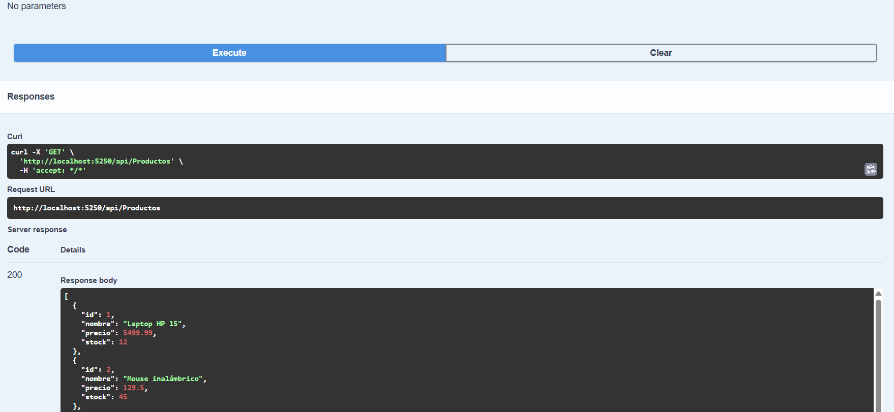
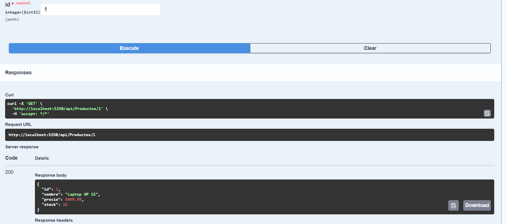

# TiendaProductosAPI

API REST para consultar los productos de una tienda. El proyecto está pensado como una práctica universitaria de ASP.NET Core Web API con arquitectura en capas y persistencia en SQL Server.

## Descripción breve del sistema

El sistema permite consultar el catálogo de productos de una tienda. Cada producto tiene un identificador, un nombre, un precio y una cantidad de stock. La información se guarda en SQL Server y se obtiene mediante Entity Framework Core. Por ahora la API solo permite consultas; no incluye alta, modificación ni eliminación de productos.

## Funcionalidades disponibles

- Consultar todos los productos registrados.
- Consultar un producto específico por su ID.
- Validar que el ID sea mayor que cero.
- Informar cuando un producto no existe.
- Probar los endpoints desde Swagger.

## Tecnologías utilizadas

- C#
- ASP.NET Core Web API (.NET 8)
- Entity Framework Core
- SQL Server / SQL Server LocalDB
- Swagger / OpenAPI
- Inyección de dependencias de ASP.NET Core

## Arquitectura en capas

El proyecto separa las responsabilidades en capas para que cada clase tenga un trabajo claro:

- **Controller:** recibe la petición HTTP y decide qué código de respuesta enviar.
- **Service:** coordina la operación y se comunica con el Repository a través de una interfaz.
- **Repository:** consulta la base de datos con Entity Framework Core.
- **DbContext:** representa la conexión con SQL Server.

Esta separación facilita explicar el proyecto, mantenerlo y cambiar una parte sin afectar a las demás.

## Flujo de la aplicación

```text
Controller -> Service -> IProductoRepository -> ProductoRepository -> Base de datos
```

En la práctica, el flujo queda así:

1. El usuario llama un endpoint desde Swagger o un cliente HTTP.
2. `ProductosController` recibe la petición y la envía a `ProductoService`.
3. `ProductoService` solicita los datos a `IProductoRepository`.
4. `ProductoRepository` consulta SQL Server mediante `TiendaDbContext`.
5. El resultado regresa por las mismas capas hasta el Controller, que responde al usuario.

## Estructura de carpetas del proyecto

```text
TiendaProductosAPI/
├── Controllers/
│   └── ProductosController.cs
├── Data/
│   └── TiendaDbContext.cs
├── Interfaces/
│   ├── IProductoRepository.cs
│   └── IProductoService.cs
├── Models/
│   └── Producto.cs
├── Repositories/
│   └── ProductoRepository.cs
├── Services/
│   └── ProductoService.cs
├── Migrations/
├── Properties/
│   └── launchSettings.json
├── docs/
│   ├── captura1.png
│   └── captura2.png
├── appsettings.json
├── Program.cs
└── README.md
```

## Requisitos previos

- Windows con SDK de .NET 8 o superior.
- SQL Server LocalDB (incluido normalmente con Visual Studio) o una instancia de SQL Server.
- Herramienta `dotnet-ef` para crear y aplicar migraciones.

Para comprobar el SDK instalado:

```bash
dotnet --version
```

Si `dotnet ef` no está disponible, instálalo con:

```bash
dotnet tool install --global dotnet-ef
```

## Configurar la cadena de conexión

La cadena de conexión se encuentra en `appsettings.json` con el nombre `TiendaConnection`.

En este equipo se detectó SQL Server Express, por eso la cadena actual apunta a `.\SQLEXPRESS`:

```json
"ConnectionStrings": {
  "TiendaConnection": "Server=.\\SQLEXPRESS;Database=TiendaProductosDB;Trusted_Connection=True;MultipleActiveResultSets=true;TrustServerCertificate=True"
}
```

Si tu computadora usa SQL Server LocalDB, cambia el servidor a:

```text
Server=(localdb)\\mssqllocaldb;Database=TiendaProductosDB;Trusted_Connection=True;MultipleActiveResultSets=true;TrustServerCertificate=True
```

Otros ejemplos:

- Instancia local predeterminada con autenticación de Windows:

```text
Server=localhost;Database=TiendaProductosDB;Trusted_Connection=True;TrustServerCertificate=True
```

- SQL Server con usuario y contraseña:

```text
Server=NOMBRE_SERVIDOR;Database=TiendaProductosDB;User Id=USUARIO;Password=CONTRASEÑA;TrustServerCertificate=True
```

No es necesario modificar el código de las clases: Entity Framework lee la cadena desde `appsettings.json`.

## Crear la base de datos

La base de datos se crea con migraciones de Entity Framework Core. El comando `database update` genera la base `TiendaProductosDB` y la tabla `Productos`, e inserta cinco productos de prueba.

## Restaurar dependencias y ejecutar migraciones

Desde la carpeta del proyecto `TiendaProductosAPI`:

```bash
dotnet restore
dotnet ef migrations add CreacionInicial
dotnet ef database update
dotnet build
```

Si la migración `CreacionInicial` ya existe, no es necesario volver a crearla. En ese caso basta con restaurar, actualizar la base de datos y compilar:

```bash
dotnet restore
dotnet ef database update
dotnet build
```

## Ejecutar el proyecto

Desde la carpeta `TiendaProductosAPI`:

```bash
dotnet run
```

También se puede abrir la solución `TiendaProductosAPI.sln` en Visual Studio o Visual Studio Code y ejecutar el perfil `http` o `https`.

Al iniciar, la API queda disponible en:

- HTTP: `http://localhost:5250`
- HTTPS: `https://localhost:7238`
- Swagger: `http://localhost:5250/swagger`

## Endpoints

| Método | Ruta | Descripción |
| --- | --- | --- |
| GET | `/api/productos` | Devuelve todos los productos. Responde `200 OK`. |
| GET | `/api/productos/{id}` | Devuelve un producto por ID. Responde `200 OK` si existe, `404 Not Found` si no existe y `400 Bad Request` si el ID no es válido. |

## Probar la API desde Swagger

1. Ejecuta el proyecto con `dotnet run`.
2. Abre el navegador en `http://localhost:5250/swagger`.
3. Localiza el controlador `Productos`.
4. Prueba `GET /api/productos` y pulsa **Try it out** y luego **Execute**.
5. Debes ver una lista con los productos iniciales.
6. Prueba `GET /api/productos/{id}` con el valor `1`. Debes recibir el producto correspondiente.
7. Prueba con un ID inexistente, por ejemplo `99`. Debes recibir `404 Not Found` y un mensaje indicando que no se encontró el producto.
8. Prueba con un ID inválido, por ejemplo `0`. Debes recibir `400 Bad Request`.

## Captura de endpoints funcionando

### Consulta de todos los productos



### Consulta de un producto por ID



## Pregunta de reflexión

**¿Qué ventaja obtiene el sistema al hacer que el Service dependa de una interfaz (`IRepository`) en lugar de depender directamente de una clase concreta de Repository?**

Al hacer que el Service dependa de una interfaz y no de una clase concreta, las capas quedan menos unidas. El Service solo sabe qué operaciones necesita, como obtener todos los productos o buscar uno por ID, pero no conoce los detalles de cómo se consulta SQL Server. Si más adelante se cambia la forma de guardar los datos, se puede crear otro Repository que cumpla la misma interfaz sin tener que modificar el Service. También facilita las pruebas, porque se puede usar una implementación sencilla de la interfaz en lugar de conectar la base de datos real. En conjunto, el proyecto se vuelve más fácil de mantener, porque cada capa puede cambiar con menos impacto sobre las demás.

